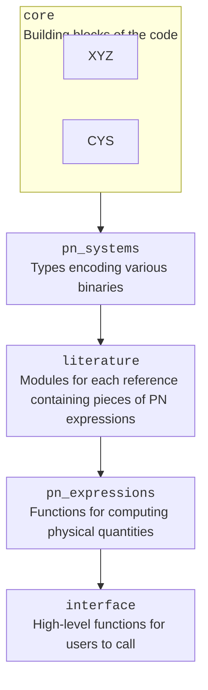

# Diagram

- PostNewtonian
  - interface: high-level functions for users to call
    - orbital_evolution
    - waveform
    - pn
  - pn_expressions: functions for computing physical quantities
    - flux
    - energy
    - angular_momentum
    - precession
    - dynamics
    - waveforms
  - literature: modules for each reference containing pieces of PN expressions
    - common variables
    - Ref1
      - import fundamental variables
      - import common variables
      - define variables not in common variables
      - write individual expressions as separate functions with `@pn_expression`
  - pn_systems: types encoding various binaries
    - PNSystem
      - AbstractBBHSystem
        - QuasicircularBBH
        - QuasisphericalBBH
        - EccentricNonspinningBBH
        - BBH
      - AbstractBHNSSystem
        - BHNS
      - AbstractNSNSSystem
        - NSNS
  - core: the building blocks of the code
    - PNExpression
    - PNReference
    - PNExpansion
    - PNTerm

- `PNSystem`
  - Define abstract subtypes:
    - `AbstractBBHSystem`
      - `QuasicircularBBH`
      - `QuasisphericalBBH`
      - `EccentricNonspinningBBH`

- `PNExpression`
- `PNExpansion`
- `PNTerm`

- literature
  - common variables
  - each reference
    - directory and module named by bibtex key
    - modules are imported directly under top-level `PostNewtonian`
    - explicitly import any fundamental variables used in the expressions
    - import variables that are defined the same as the common variables
    - define variables that are not defined in the common variables
    - write individuals

- PN expressions
  - Assemble functions for high-level quantities like flux, etc.
  - Inside each function, simply call the expressions from the
    literature, prepending with module name.

`@pn_expression` will

1. look for symbols in the expression, and for any that matches a function
   name in the current module, add a `let` binding for that symbol to equal
   the function called on the `pnsystem` argument.
